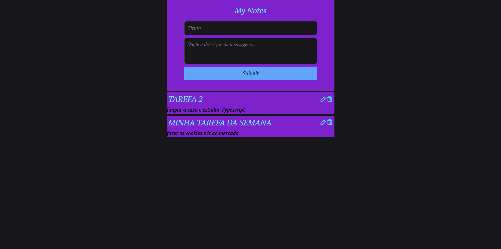

# MESSAGES WEB

React project to consume the messages API node and list all messages the front end

## Getting started

run `npm i` or `yarn` to get all the dependecies

run `npm run dev` or `yarn dev` to start the application

## Languages, Frameworks

* [JS](https://www.javascript.com)

* [TS](https://www.typescriptlang.org)

* [REACT](https://reactjs.org)

* [VITE](https://vitejs.dev)

* [AXIOS](https://www.npmjs.com/package/axios)

* [Tailwind](https://tailwindcss.com)

* [PHOSPHOR](https://phosphoricons.com)
